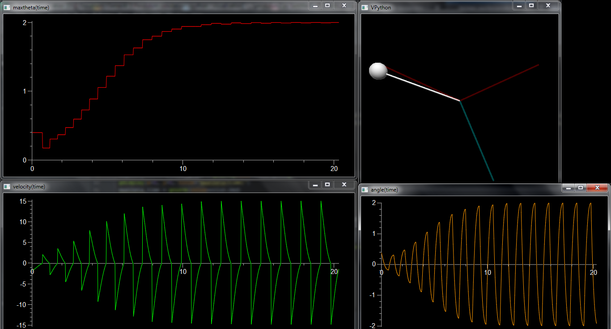
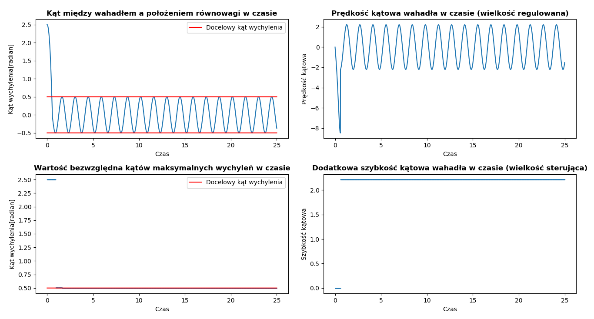
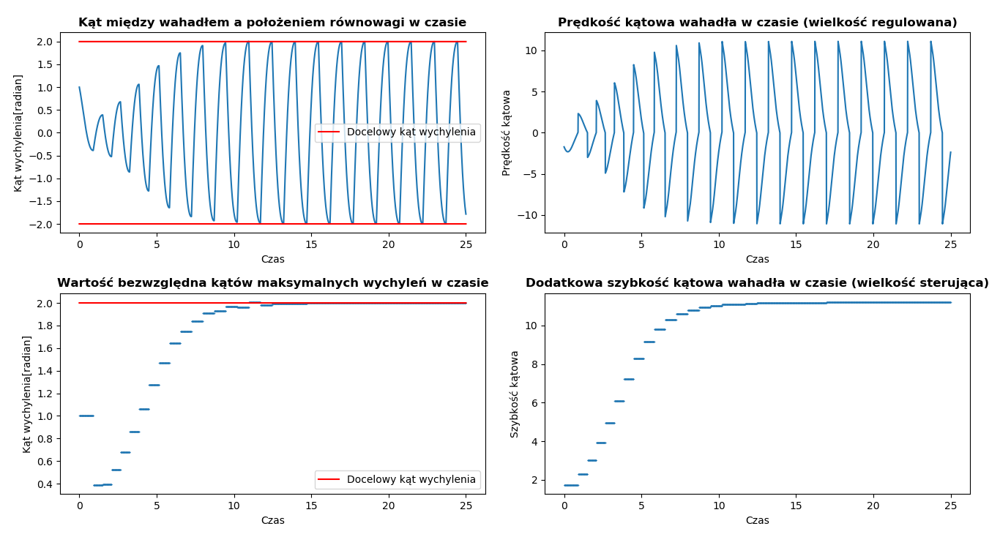

# Pendulum simulation

University project for "Basics of automation". Pendulum visual simulation along with its state applied on plots written in Python 2 using Vpython and Matplotlib packages. Given initial angle, its task is to reach target agle in finite amount of time.

## Prerequisites

* Python 2.7
* Vpython 6.11
* Matplotlib

## Configuration

| Parameter | Description |
| --- | --- |
| end_time | Simulation duration |
| dt | Time step |
| initial_angle | Initial pendulum angle (-PI, PI) |
| target_angle | Target pendulum angle (0, PI) |
| damping | Pendulum damping |
| accuracy | Pendulum accuracy <1;--) |
| mass | Mass of ball|
| length | Length of rod |
| gravity | Gravity force |

Accuracy is proportional to the time needed to reach target angle [more accuracy = more time = more precise final angle].

## Output

| Variable name | Description |
| --- | --- |
| angle_list | list of angles |
| max_angle_list | list of maxiumum angles |
| velocity_list | list of velocities |
| additional_velocity_list | list of additional velocities |
| time_list | list of discrete time values |

## Screenshots

